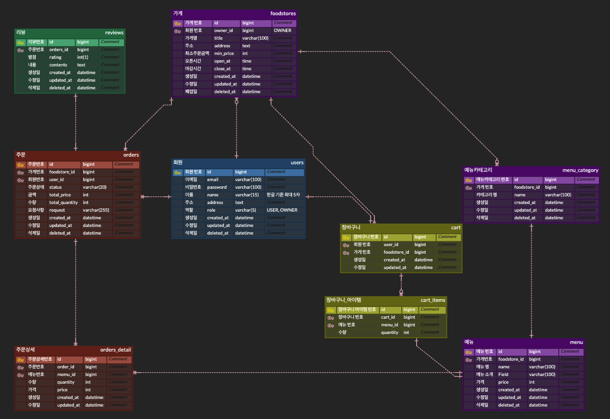

# 아웃소싱 프로젝트 (14조)

## 프로젝트 정보
| 구분     | 내용                                                   |
|--------|------------------------------------------------------|
| 기간     | 2025.02.28 ~ 2025.03.07 (7일)                                |
| 팀원     | 최다원(팀장), 최유리, 김성찬, 박상부, 정청원                                |
| 설명     | User, Schedule, Comment로 구성된 일정 관리 앱의 백엔드 구성.        |
| 사용 기술  | Java, Spring MVC, JPA, Spring Data JPA, MySQL                 |
| JDK    | Amazon Corretto 17.0.14                    |
| Spring | Boot 3.4.2, Core 6.2.2                               |
  
  

## 역할 분담

| 팀원  | 내용                             |
|-----|--------------------------------|
| 최다원 | 로그인, 회원가입, 회원 조회, 회원 삭제, 소셜 로그인 |
| 최유리 | 주문 CRUD, 장바구니 CRUD             |
| 김성찬 | 메뉴 CRUD, 메뉴 카테고리 CRUD, 관리자 대시보드 |
| 박상부 | 리뷰 CRUD                        | 
| 정청원 | 가게 CRUD, 즐겨찾기 CRUD, 이미지 저장     |

  

## 와이어 프레임

  

## ERD

  

## API 명세서
 

  
<b>회원, 소셜로그인</b>

   
  

    <image src="https://github.com/user-attachments/assets/b67b75d3-7ba9-4f51-8026-695cf8288aee" width=80%></image>
  

  
<b>메뉴,메뉴 카테고리,관리자 대시보드</b>

   
  

    <image src="https://github.com/user-attachments/assets/bbfff505-e57b-4928-a846-ab996e99296c" width="80%"></image>
    <image src="https://github.com/user-attachments/assets/59f35a63-158d-41fc-8ddb-933687afdaf9" width="80%"></image>
    <image src="https://github.com/user-attachments/assets/0451a1cb-35ba-4222-8129-89617c299da6" width="80%"></image>
    <image src="https://github.com/user-attachments/assets/60106b54-8068-4567-a2b4-b8fdd5104e19" width="80%"></image>

  

  
<b>가게</b>

   
  

    <image src="https://github.com/user-attachments/assets/6078b9af-fd67-4b53-9b2c-c9f4efdfa1de" width="80%"></image>
    <image src="https://github.com/user-attachments/assets/3f733269-191d-4aeb-945b-88e7a14659e4" width="80%"></image>
    
  

  
<b>주문, 장바구니</b>

   
  

    <image src="https://github.com/user-attachments/assets/99016396-8f21-472b-8d75-91a625b64839" width="80%"></image>
    <image src="https://github.com/user-attachments/assets/7c58efc1-5eb0-4a9b-870e-9dc2b7b78fbb" width="80%"></image>
    <image src="https://github.com/user-attachments/assets/6f1c254d-6ff1-46b6-9937-702253bb8b26" width="80%"></image>
    <image src="https://github.com/user-attachments/assets/53329fee-57f4-4b91-b055-897f80d533c2" width="80%"></image>
    <image src="https://github.com/user-attachments/assets/e7bd3edd-f5bc-40c4-b1f2-40df58ba4ba1" width="80%"></image>
  

  
<b>리뷰</b>

   
  

    <image src="https://github.com/user-attachments/assets/b5e5349e-9fe9-430e-96e4-ed39f4c66ca3" width="80%"></image>
  

